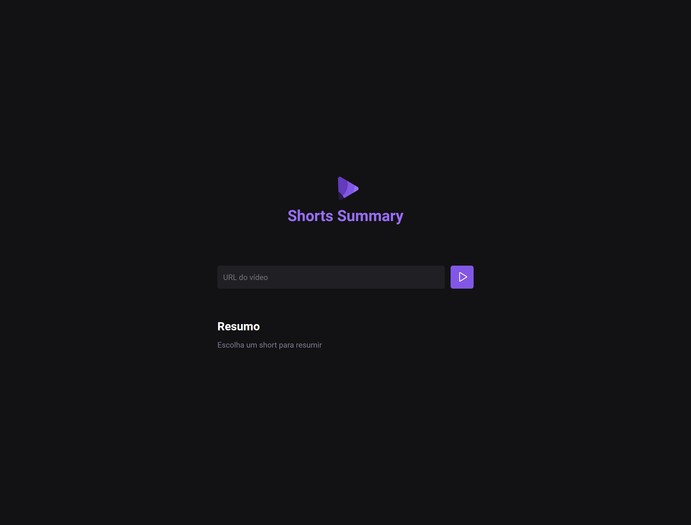

# NLW IA 

> Trilha Foundations

Projeto construído no evento Next Level Week da Rocketseat. 
Funcionamento do projeto:
- por meio de um link shorts do youtube conseguimos enviar uma requisição para o back-end;
- o back-end converte o vídeo em áudio;
- o áudio é encaminhado para uma inteligência artificial realizar uma transcrição;
- por fim a IA faz um resumo dessa transcrição e retorna para o front-end essa informação para ser exibida ao usuário.

## 👨‍💻🛠 Tecnologias

- HTML
- CSS
- Vite
- JavaScript

## 📩 Contato

wedley.pereira2011@hotmail.com